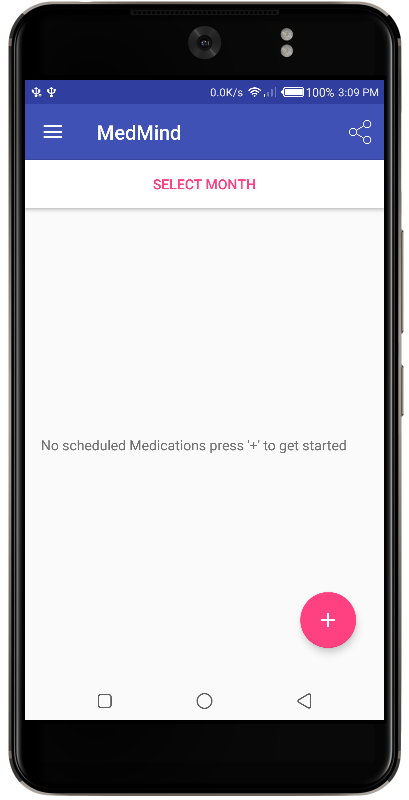
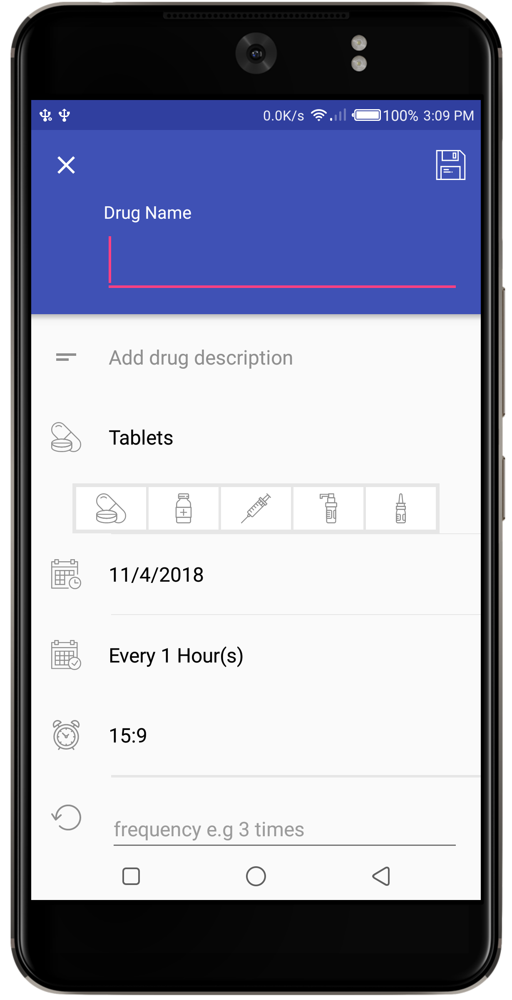
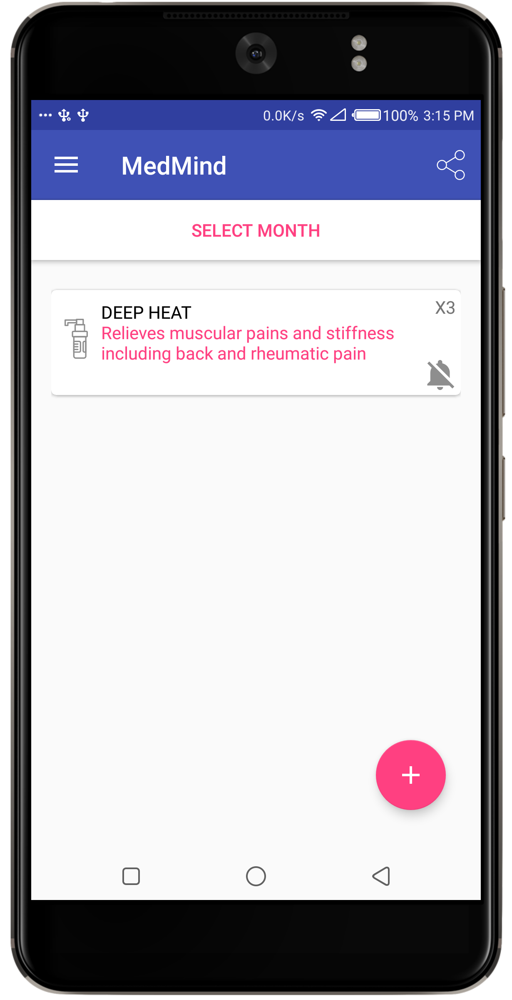
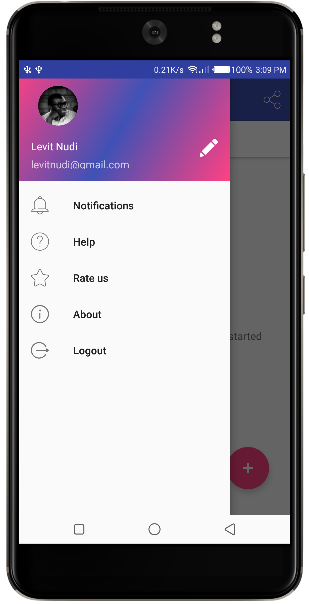
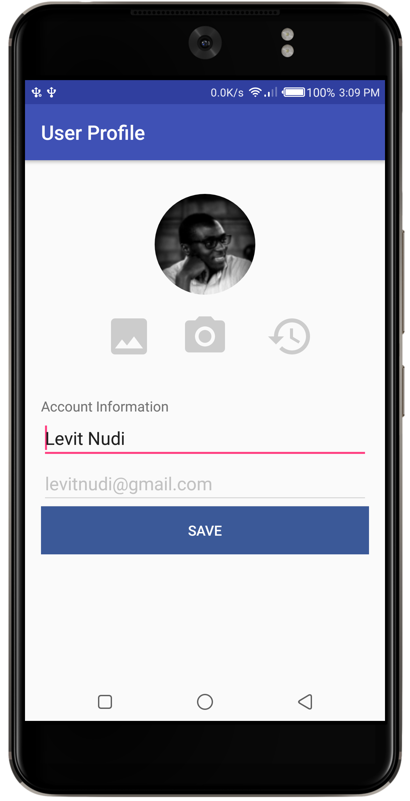

# MedMind
Andela Take A Climb Challenge, Medicine Manager App

# MedMind.

This is a simple medicine managing app for patients.
It has simple basic reminder with the following technologies ; 
alarm service implementation, SQLite database, Shared
preference persistence, Calendar and time Chooser, Google Login, basic profile changes can also be made through the app. 

Feel free to contribute, filtering by month and other functionalities.

# Screen Shots

# Author : Levit Nudi 

